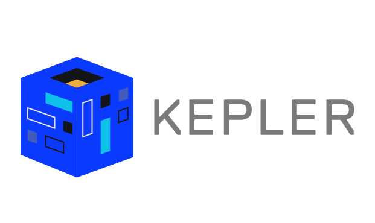

<div align="center">
    
 
  <p>
    <a href="https://github.com/Exein-io/kepler/actions/workflows/test.yaml">
      
    </a>
    <a href="https://opensource.org/licenses/Apache-2.0">
      
    </a>
  </p>
</div>

<br/>

Kepler is a vulnerability database and lookup store and API currently utilising [National Vulnerability Database](https://nvd.nist.gov/) as data sources; implementing CPE 2.3 tree expressions and version range evaluation in realtime.

<br/>

# Setup

## [Docker](https://docs.docker.com/engine/install/) (recommended)

We provide a docker bundle with `kepler`, dedicated PostgreSQL database and [Ofelia](https://github.com/mcuadros/ofelia) as job scheduler for continuous update

```bash
export CONTAINER_SOCKET=/var/run/docker.sock
```

```bash
docker compose build
docker-compose up
```

## [Podman](https://podman.io/docs/installation) (optional)

```bash
export CONTAINER_SOCKET=/run/user/1000/podman/podman.sock
```

```bash
podman compose build
podman-compose up
```

Or just use an alias:

```
alias docker=podman
```

### Database migration notes
When the application starts checks for pending database migrations and automatically applies them. Remove the `--migrate` option to stop when a pending migration is detected

## Migration runner (diesel-cli)

If you're interested in adding new migrations you should check out and instal [Diesel-cli](https://diesel.rs/guides/getting-started).

After you have `diesel-cli` [installed](https://diesel.rs/guides/getting-started#installing-diesel-cli), you can run:

```bash
diesel migration generate <name_your_migration>
```

This will generae `up.sql` and `down.sql` files which you can than apply with :

```bash
diesel migration run
```

- Or by re-starting your kepler conainer (this auto triggers migrations)


## Build from sources

Alternatively you can build `kepler` from sources. To build you need `rust`, `cargo` and `libpg-dev` (or equivalent PostgreSQL library for your Linux distribution)

```
cargo build --release
```

# Data sources

The system will automatically fetch and import new records every 3 hours if you use our [bundle](#docker-recommended), while historical data must be imported manually.

Kepler currently supports two data sources, [National Vulnerability Database](https://nvd.nist.gov/) and [NPM Advisories](https://npmjs.org/). You can import the data sources historically as follows.

## NIST Data

To import NIST records from all available years (2002 to 2025):

```bash
for year in $(seq 2002 2025); do 
    docker run --rm \
        -v $(pwd)/data:/data:Z \
        -e DB_HOST=db \
        -e DB_PORT=5432 \
        -e DB_USER=kepler \
        -e DB_PASSWORD=kepler \
        -e DB_DATABASE=kepler \
        --network=kepler_default \
        kepler:dev import_nist $year -d /data
done
```

- System will automatically fetch and import new records records every 3 hours. (using schedulled `ofelia` job)

- Append `--refresh` argument if you want to refetch from [National Vulnerability Database (NVD)](https://nvd.nist.gov/) source.

Example - Refresh data for 2025

```bash
for year in $(seq 2025 2025); do 
    docker run --rm \
        -v $(pwd)/data:/data:Z \
        -e DB_HOST=db \
        -e DB_PORT=5432 \
        -e DB_USER=kepler \
        -e DB_PASSWORD=kepler \
        -e DB_DATABASE=kepler \
        -e KEPLER_BATCH_SIZE=5000 \
        --network=kepler_default \
        kepler:dev import_nist $year -d /data --refresh
done
```

### Database tear down

If you want to rebuild your dabase. You would do it in these steps:

```bash
docker-compose down -v # -v (bring down volumes)
```

```bash
docker compose build # optional (if you made some backend changes)
```

```bash
docker-compose up
```

Than re-trigger the [NIST data Import](#nist-data) step.

# APIs

There are two primary APIs as of right now — the `product` API and the `cve` API detailed below.

## Products API

Products can be listed:

```bash
curl http://localhost:8000/products
```

Grouped by vendor:

```bash
curl http://localhost:8000/products/by_vendor
```

Or searched:

```bash
curl http://localhost:8000/products/search/iphone
```

## CVEs API

To use the vulnerabilities search API via cURL (prepend `node-` to the product name in order to search for NPM specific packages):

```bash
curl \
    --header "Content-Type: application/json" \
    --request POST \
    --data '{"product":"libxml2","version":"2.9.10"}' \
    http://localhost:8000/cve/search
```

Responses are cached in memory with a LRU limit of 4096 elements.

### Troubleshooting

If you get the `linking with cc` error that looks similar to this one, you're likely missing some `c` related tooling or libs.

```bash
error: linking with `cc` failed: exit status: 1
//...
= note: /usr/bin/ld: cannot find -lpq: No such file or directory
  collect2: error: ld returned 1 exit status
```

This one required Postgres related clib to be added.

Fedora
```bash
sudo dnf install postgresql-devel
```

Arch
```bash
sudo pacman -S postgresql-libs
```
